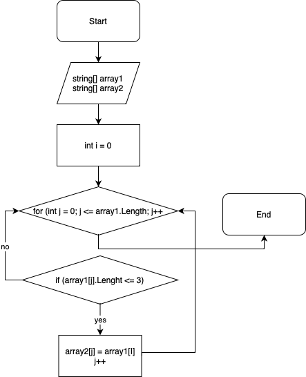

# Итоговая проверочная работа #

## Задача ##

Написать программу, которая из имеющегося массива строк формирует массив из строк, длина которых меньше либо равна 3 символа. Первоначальный массив можно ввести с клавиатуры, либо задать на старте выполнения алгоритма. При решении не рекомендуется пользоваться коллекциями, лучше обойтись исключительно массивами.

## Описание алгоритма:

1.Ввод первоначального массива, создание пустого второго массива, соразмерного с первым массивом.

2.Создание метода, в котором первый массив перебирается при помощи цикла с проверкой условия <= 3. Если больше, то j первого массива присваивается i второго массива.

3.Создание метода, который выводит второй массив из строк, длина которых будет меньше или равно трем символам.

## Блок-схема 

